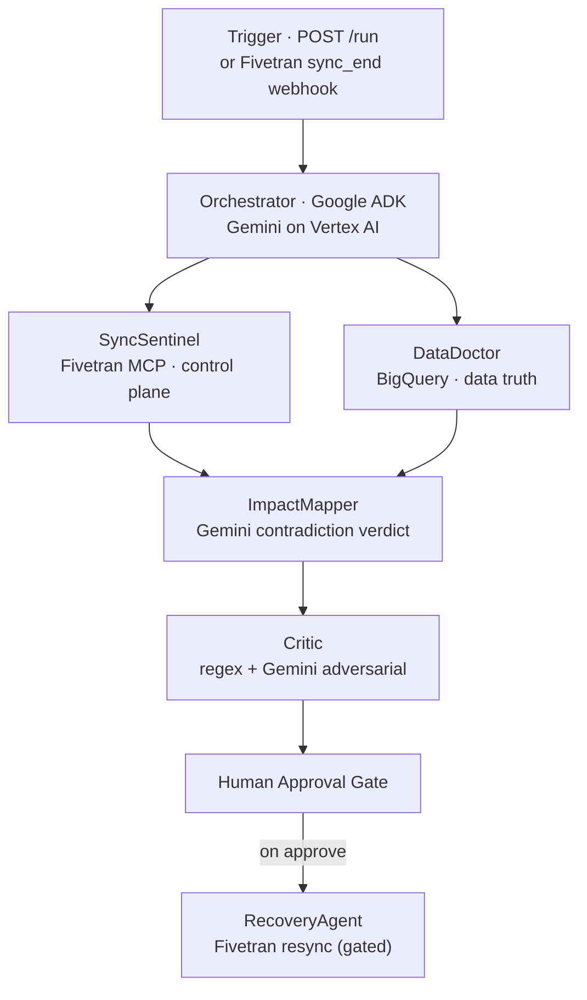

<!--
  TideSync — Devpost "Project details" / "About the project"
  Paste the body below into Devpost. Upload the 4 PNGs in this folder to Project Media.
  Devpost does NOT render Mermaid — for the Devpost paste, drop the ```mermaid block
  (the uploaded PNGs cover it). On GitHub, both the PNGs and the Mermaid render.
-->

> **TideSync is demonstrated on maritime logistics, but it works for any data pipeline** — finance period closes, ML feature stores, clinical record syncs, analytics warehouses.

## Inspiration

Every data pipeline has a control plane that reports success and a destination that holds the truth — and the two disagree more often than anyone admits. Your sync tool says "completed, 1.2M rows, green checkmark." The warehouse table it wrote to last updated four hours ago. Nobody gets paged, because nothing *failed*. The dashboards downstream just quietly serve stale numbers until someone notices a report is wrong — usually after a decision was already made on it.

A successful sync status is **not** evidence that the data is fresh. Only the destination knows that. We built the agent that checks.


## What it does

TideSync catches one specific, expensive, silent failure: **the pipeline says it succeeded, but the data is stale.** It:

1. Reads pipeline status from the **control plane** (Fivetran, through the official Fivetran MCP server).
2. Queries the **destination directly** for the real freshness of the data (BigQuery — `MAX(_fivetran_synced)`, lag in seconds, row counts, null-rate drift).
3. Uses **Gemini** to reason about the *contradiction* between the two, emitting a confidence-scored verdict, an **SLA-breach projection** (how long until the data crosses your freshness limit), and a recommended fix.
4. **Stops at a human approval gate** — a resync only fires after a human approves, and only with the write flag set.

The whole product is the contradiction: control plane green, data stale, and an agent that triangulates the two and reasons about where they disagree.

## How we built it

A sequential orchestrator on **Google ADK**, on **Cloud Run**, with **Gemini on Vertex AI** as the reasoner.

**System architecture — two planes, control vs truth:**


**The pipeline** — `SyncSentinel + DataDoctor → ImpactMapper (Gemini) → Critic (regex + Gemini) → human gate → RecoveryAgent`:




**Gemini is the brain** — the Fivetran status and the BigQuery lag become structured context, Gemini reasons to a contradiction verdict, and a second Gemini Critic challenges it:


The Fivetran integration is a **real Model Context Protocol** integration, not a REST wrapper: TideSync spawns the official open-source `fivetran/fivetran-mcp` server as a subprocess and talks to it over **stdio**. Control-plane reads go **MCP-first** with a direct-REST fallback so a live demo never depends on the subprocess. You can verify it live: `GET /mcp/tools` returns `connected: true` and the full tool surface (77 tools as deployed).

**Stack:** Python · Google ADK · Gemini 2.5 Flash (Vertex AI) · Fivetran (`fivetran/fivetran-mcp` over stdio, REST fallback) · Google BigQuery · FastAPI · Next.js + Tailwind · Cloud Run · Secret Manager · Docker.

## Challenges we ran into

- **The whole product is a contradiction.** Status tools and data-freshness tools live in different systems; there was no single source to query. We had to triangulate two independent ones — Fivetran's control plane and BigQuery's `MAX(_fivetran_synced)` — and have Gemini reason precisely about the gap (and project the SLA breach), not just diff two numbers.
- **A real Fivetran MCP, not a REST shim.** We clone `fivetran/fivetran-mcp` into the container and talk to it over stdio. The hard part was making it bulletproof for a live demo: control-plane reads go MCP-first but fall back to direct REST automatically, so a subprocess hiccup never breaks the run — while `GET /mcp/tools` proves the MCP path is real (77 tools).
- **Defending an agent that reads pipeline metadata.** Connector names and table contents are user-influenced, so we run a deterministic regex pre-screen *and* an adversarial Gemini critic that can flag a manipulated field — and every remediation is gated behind a human token plus an explicit write flag.
- **Never auto-fixing.** A resync is a write to production data infrastructure. TideSync returns `awaiting_approval` and only triggers RecoveryAgent after `POST /approve` with `FIVETRAN_ALLOW_WRITES=true`.

## Accomplishments that we're proud of

- It catches **silent staleness that no status dashboard can see** — green pipeline, stale data.
- A **genuine Fivetran MCP integration** (77 tools over stdio) with an automatic REST fallback, provable at `/mcp/tools`.
- Gemini **contradiction reasoning + an SLA-breach projection**, not just a freshness number.
- A two-layer adversarial Critic and a **human-gated resync** — TideSync recommends, a human decides.

## What we learned

- **Status is not truth.** Only the destination knows whether data is fresh; an agent that checks both is the only way to catch the gap.
- **MCP-first with a REST fallback** is the pattern for a deep partner integration that's also demo-bulletproof.
- Two independent sources of truth plus an LLM to reason the contradiction beats any single alert threshold.

## What's next for TideSync

- More destinations beyond BigQuery (Snowflake, Redshift, Databricks).
- Null-rate and schema-drift alerts alongside freshness.
- Human-approved auto-recovery playbooks per connector.
- Freshness-trend forecasting — predict the breach before it happens.

---

**Built with** (Devpost tag field): `python · google-adk · gemini · vertex-ai · fivetran · model-context-protocol · bigquery · fastapi · next.js · tailwindcss · google-cloud-run · secret-manager · docker`

**Try it out:**
- Live dashboard — https://tidesync-dashboard-o34wppiwiq-uc.a.run.app
- GitHub — https://github.com/shipsafe-ai/shipsafe-tidesync
- One command — `npx shipsafe-tidesync demo`
